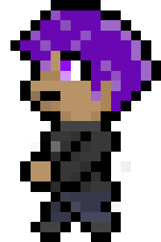
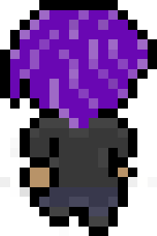
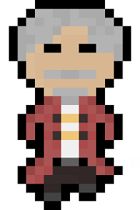
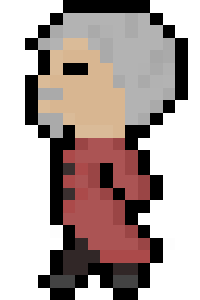
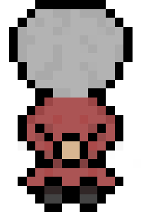

## About project

I was in the process of creating a 2D RPG in Java and I needed to add graphics. Since it was a small 2D game I was making, I could get away with using pixelated graphics. They are easy to make and does not require any professional equipment to make them look appealing. Unfortunately I ended up not finishing the 2D game but I still kept the assets for use in future video game projects that I will create. 

## My contribution

All of the images in this project were created by me but I did reference some images from games that also uses pixel art graphics. One of which was stardew valley.I had only designed two different entities, the player and an npc that I designated as the mayor. However, I did create multiple different sprites for each of the two in order to animate their movement. I had created 12 for the mayor and 14 for the player. I've also created graphics like terrain, walls, and trees. The dimensions of the characters were 16x24 and the other graphcial features were 16x16. Since I was working with creating 16x16 image, I would have to make multiple versions of the terrain because you can't really fit much detail with a 16x16 canvas. However, it wasn't too bad and when you put them together, it looks amazing.

## What I learned

I learned many things from this project. It gave me an idea of how video game developers create their graphics especially if it's for a 2D game. Not sure about the newer games, but games like the early versions of Legend of Zelda and Final Fantasy may have used the technique of connecting different images of the same asset in order to make them look like one big graphic. I also learned how to make my images look like they are moving which was very satisfying to see.

Below our a few sprites that I made for the player (Top) and the mayor (Bottom). These are scaled to larger a size in order to see the individual pixels.

  
  
  

  
  
  

