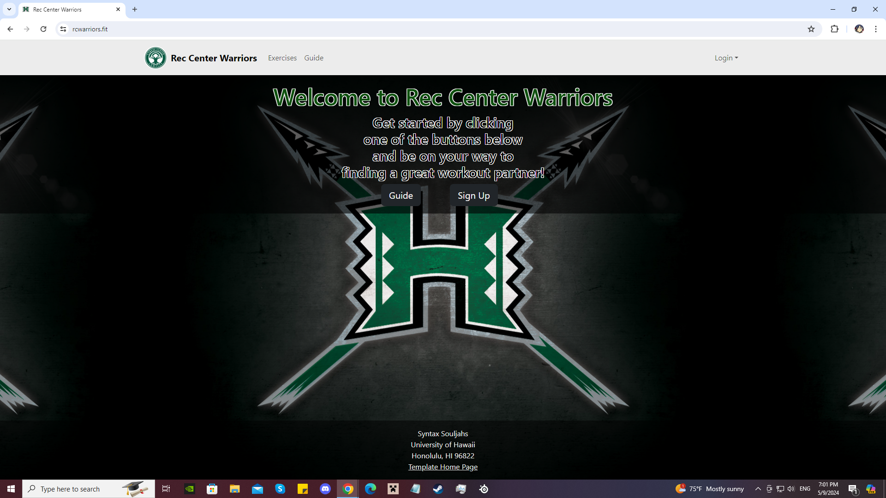
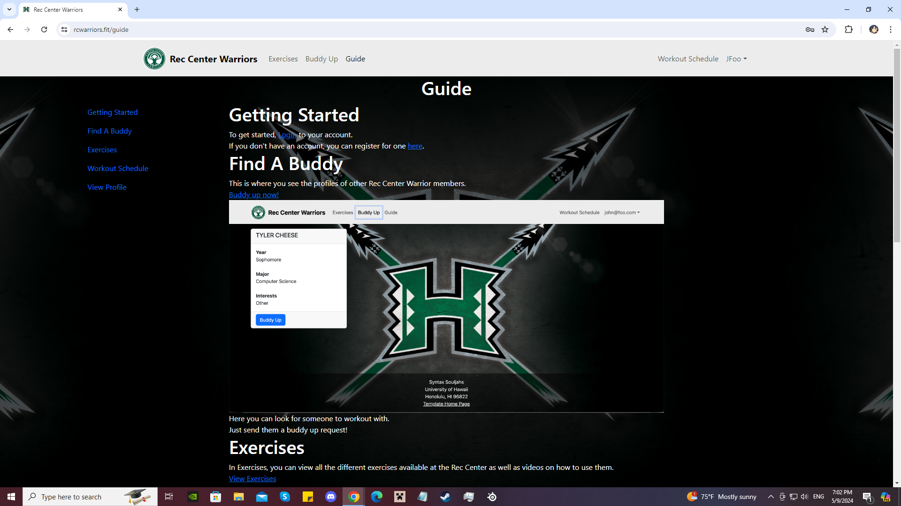
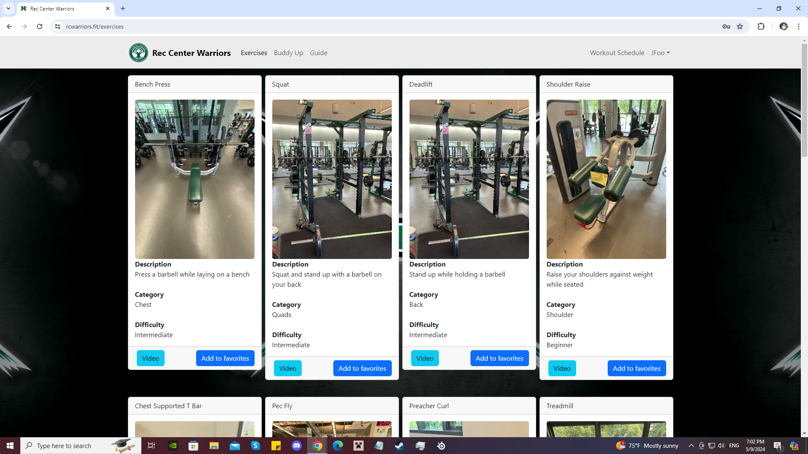
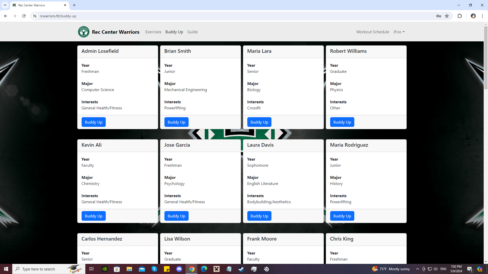
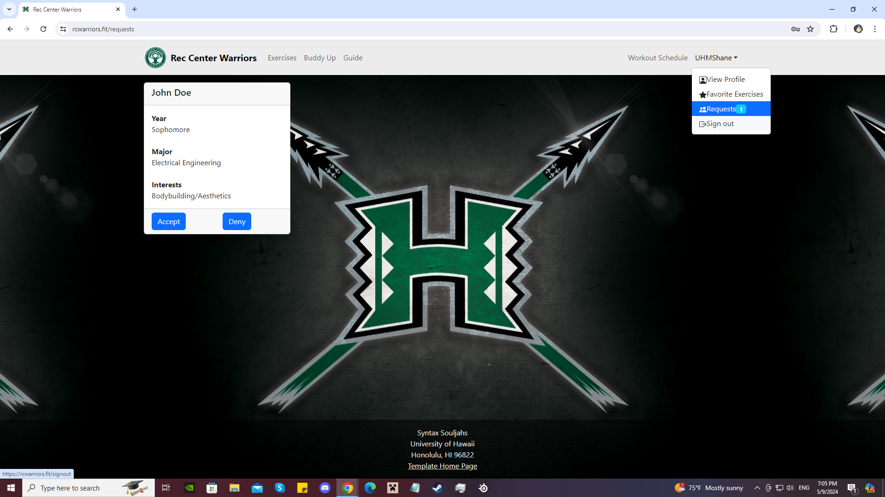

## About the Project

The idea of this project is to create a web application for people that frequent, or plan on frequenting, the Rec Center at the University of Hawai'i at Manoa campus. There are many people that workout by themselves, but working out by yourself is both boring and unsafe. So our organization, [Syntax-Souljahs](https://syntax-souljahs.github.io/), has decided to develop a website for those people to find someone to buddy up with. This project was developed using Meteor as our web application framework, React Bootstrap as our UI Design framework, MongoDB as our database, and GitHub to manage the project. The website was deployed on digital ocean. You can view the website here at https://rcwarriors.fit/.

### Contributors

Excluding myself, the organization consisted of 5 other individuals: [Ronan Russel Andal](https://github.com/RonanAndal), [Alvin Wu](https://github.com/wualvin2021), [Isai Foglesong](https://github.com/isai-foglesong), [Hunter Von Tungeln](https://github.com/HunterVT), and [Tyler Mak](https://github.com/tylermak16).

## What I Contributed to the Project

Most of what I did for the project was front end development for the web application. I was responsible for creating the landing page, the exercise page, the guide page, the buddy up page, and the requests page. I also did some back end development like creating the mongoDB collections, and reading and writing to those collections.

### Landing Page

The landing page is what the user sees if they are not logged in with an account. They are greeted with some text welcoming them to the site. There are two buttons, one to take them to the signup page while the other button takes them to a guide page to get an idea of how the website works. 

  

I wrote all the code for this page but the text was provided by another member.

### Guide Page

The guide page consists of information on what you can do on the website. On the left side of the page there are links that take you to its corresponding section of the page. I began creating the page when we first started the project. At that time we had about five different pages. 

  

I wrote the guide for each page, but as the project moved forward, a lot of the pages changed as well as new pages were being added. Responsibility for the guide page was taken over by another member.

### Exercise Page

The exercise page is where you'll see different exercises available to you at the Rec Center. This was done using the Card component from React Bootstrap. Each card consisted of the name of the exercise, a description of what to do, how difficult it is, and what part of the body it's for. Each card is also accompanied by an image of what the exercise machine looks like along with a few buttons. One button redirects you to a video explaining and showing you how to do the exercise properly while the other button adds it to your favorite collections page.

  

I did not initially create the page. That was done by another member. However, As the project moved forward, I ended up redesigning the page so that it was easier to incorporate our exercises collection.

### Buddy Up Page

The buddy up page displays the profiles of all other users in our database. The profile displays their name, year, major, and the type of exercises they are interested in. The user can then send a buddy up request to go to the gym with.

  

I wrote all of the code for this page. It was similar to how I wrote the exercises page so it wasn't too difficult. This was accomplished by creating a collection for requests with the attributes: buddy, and owner. Buddy is who the receiver will be and the owner is who sent the request.

### Requests Page

After a user sends a buddy up request, that request will appear on the receiving user's requests page which is located in the dropdown menu. The requests page shows all the buddy up requests they receive and is displayed similarly to the buddy up page. The only difference is instead of a buddy up button, there are two different buttons. One is to accept the request, and the other is to deny. 

  

I wrote all the code for this page. When the user accepts, they add the requester to a buddy collection with similar attributes as the request collection. The buddy and owner are swapped. Hitting either button will remove the request from the requests collection. I also added a badge next to the requests page to show how many requests they have.

## The knowledge I have gained

This was my first real software engineering project I have done. I learned that being a software engineer is not a solo effort and that it is something you do within a group. Creating an application takes a long time. This project took about a month to get to where it is at now and it still could use a bit of improvement. Everything done on this project cannot be done easily with just one person. I gained a lot of tools to use in my journey to becoming a software engineer. I learned how to use frameworks like react, bootstrap, and meteor to design a webpage more efficiently. I learned about creating databases using MongoDB to keep track of the data used in our application. I also enhanced my knowledge of GitHub which also allowed me to better understand project management. When each of us finished an issue, we created pull requests and had a designated project manager review the request before merging it to the main branch.

## Final thoughts

This was an enjoyable experience that got me to use a lot of my brain power. There were times that I would stress out since I couldn't figure out how to do something and ChatGPT wasn't helpful. But I would then find inspiration reading the code my other group members wrote and that would help a lot. Hopefully I can be involved in a lot of projects much like this one and build an application for a larger demographic.
